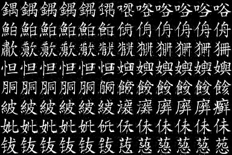
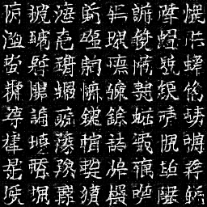
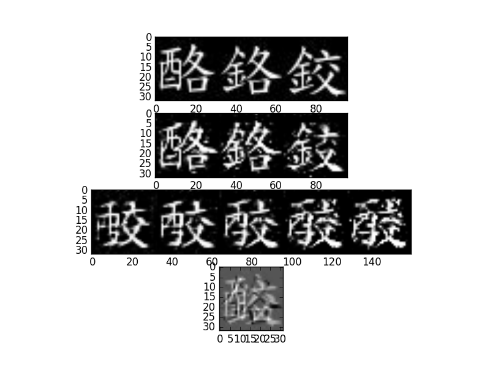

# VAE-GAN in Tensorflow
Implementation (with modifications) of [*Autoencoding beyond pixels using a learned similarity metric*](https://arxiv.org/abs/1512.09300)  
The modification is as follows: I added a Tanh layer to the latent variable z, converting the space of R into [-1, 1]. This modification is emperimental.

\*Please refer to their official Github for details*: https://github.com/andersbll/autoencoding_beyond_pixels


As the name indicates, VAE-GAN replaces GAN's generator with a variational auto-encoder, resulting in a model with both inference and generation components. I explored the latent space and find some interesting properties.


## Dependencies
### Environment
Ubuntu 16.04 ([Optional] to download data using `wget`)  
Python 3.5  


### Python Packages
1. Tensorflow v0.12  
2. Matplotlib  
3. PIL


## Experiements
### Dataset
CNS dataset: 20,000 Chinese characters (each with only one *.png file) extracted from [全字庫](http://www.cns11643.gov.tw).  
[Site](http://www.cns11643.gov.tw/AIDB/welcome_en.do)  
[Copyright](http://www.cns11643.gov.tw/AIDB/copyright.do)  
[Download](http://www.cns11643.gov.tw/AIDB/Open_Data.zip)


### Network architecture  
VAE-GAN implemented with CNN, specified in `architecture.json`


### Simple interpolation
  
Figure: Interpolation of two characters.

The right-most and the left-most images are real images.  
The second right/left-most images are self-reconstructions.  
The rest of the images are interpolations.
These images were generated during training procedures.


### Random samples from the latent space
  
Figure: images generated from randomly sampling the latent space.

These images were generated during training procedures.


### Character Arithmetics (in the latent space)
I'm interested in carrying out simple arithmetics in the latent space just as what the authors demonstrated in Word2vec and DC-GAN. In the following example, I found that the latent space was truly meaningful, though it was different than I had expected.

Chinese characters are formed by many fundamental parts. For example, the word 酪 (chese) has two parts: the left is a 酉 denoting its characteristics (related to "ferment") and the right is a 各 (individual) hinting its pronouciation. I'd like to know if it's possible to create visually plausible characters that doesn't exist in Chinese.

  
Figure: Character arithmetic expample of "A - B + C." 

1st panel (from top): the original images of the input (A, B, and C)  
2nd panel: the reconstructed images from VAE-GAN.  
3rd panel: I carried out "D = a*(A - B + C)" in the latent space and then generate an image from D.  
The coefficient `a` is [0.25, 0.5, 1, 2, 3] from left to right.  
4th panel: "A - B + C" in the input domain.

In this case, A=酪(cheese), B=鉻 (chromium), and C=鉸 (scissors).
A and B have a commom right part of 各 (individual); B and C have a common left part of 金 (metal). Therefore, we expect that conceptually A - B + C should result in a character with 酉 (right part of A) and 交 (left part of C). There is actually no character [酉交] in Chinese, but we want to see if we can create one (and it seems that we can).


## Discussion
The gamma parameter in Eq. (9) is a trade-off between *style* and *content* as mentioned in the paper. In my experiment, if gamma is set too small (such as 1e-5), the content could be lost, thus unable to reconstruct the input. However, random sampls directly generated from the latent space were realistic in this case. Setting gamma to a larger value (say, 0.1), we ended up with a good reconstruction, but the random samples could be less reasonable to the eyes.


## Usage
### Using existing models
Please modify `test.txt` file which contains the "A B C" tuples (one tuple per line)  
```bash
./get_data.sh
python validate --checkpoint logdir/train/pretrained/model.ckpt-31200
```
It'll give you a bunch of generated images as described in the "Character Arithmetics" section.  


### Train a new model
```bash
python train.py --dataset [your dataset] [options]
```

Note:  
0. If you have get the Chinese character dataset by `./get_data.sh`, you can simply run `python train.py` to re-run my training using the same dataset.  
1. You can modify `architecture.json` to try different network specifications.  
2. You can use the Tensorboard to track the training.  
3. I disabled embedding viewer in my training script. You you wanna use it, please modify and run `make_sprite.py` and `python make_tsv.py`
